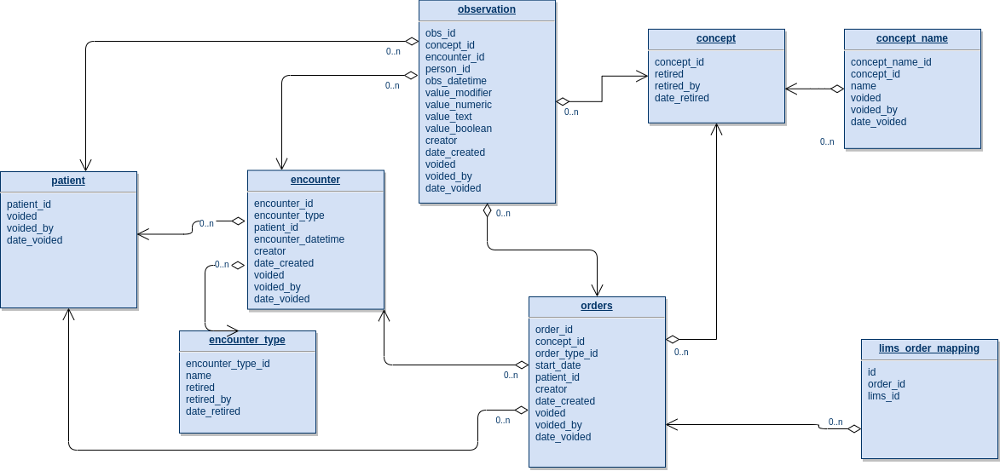
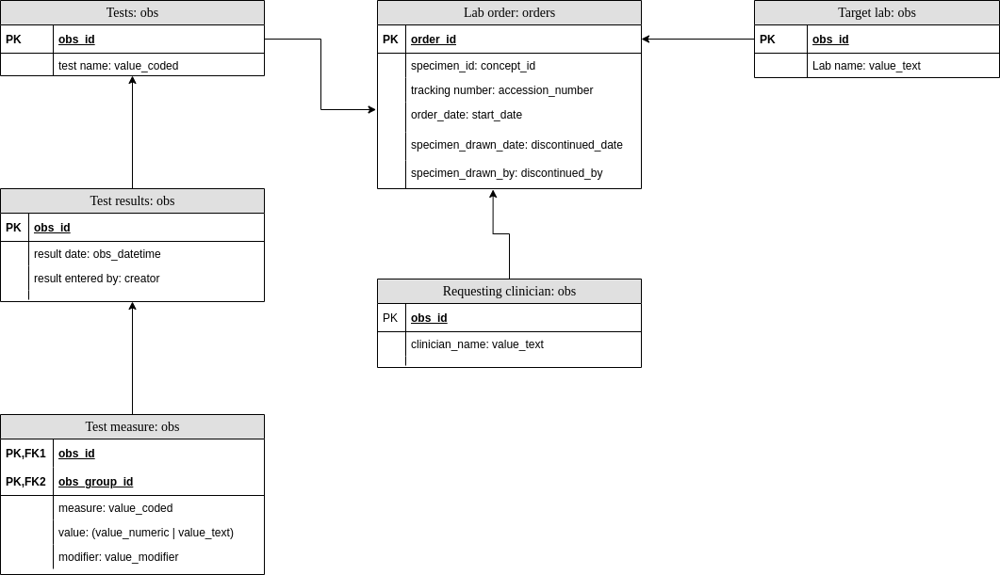

# Lab Module Data Model 

## 1.0 Introduction 

The lab module is an extension to the HIS-EMR-API that provides an Application Programming
Interface (API) for managing lab orders. It mostly utilises the same OpenMRS data model used
by the base application. The purpose of this document is to explain how this module organises
its entities with this model. This document thus will not go deep into the details of the
entity relationships within  OpenMRS but rather will just describe where and how lab orders
plus their related metadata are stored within  OpenMRS. 

## 2.0 Entity Relationships Overview 

Below is an Entity Relationship Diagram (ERD) for the database entities the Lab module
makes use of:



 

All entities above except one are lifted directly from OpenMRS. Entity _lims_order_mapping_ is
a custom addition that is used to link local orders to those existing in LIMS’ couchdb
instance. Following sections briefly discuss how each entity is used. 

### 2.1 Orders / Order Type 

This is the focal entity in the data model. It is the main trunk of a lab order; carrying information on when the order was made, the order’s tracking/accession number, the patient
being tested, and the specimen that is to be used in the tests. Lab orders have extra
information like tests being conducted, this information is spread out in observations
that directly point to this order. More on this in the observations section. Orders
belonging to the Lab module will always have an order type named Lab. 

### 2.2 Observation 

Observations in the Lab module can all be traced to a Lab order directly or
indirectly (through parent observations). These carry additional information pertaining
to a given order namely: requesting clinician, target lab, tests, reason for the
lab order, and test results. 

### 2.3 Encounter / Encounter Type 

Provided by clients of the module, this entity is used to group together a number of orders
and observations. An order an it’s associated observations are normally attached to the
same encounter. 

### 2.4 Patient 

This represents the patient being tested. Every order and observation directly points to
this patient. 

### 2.5 Concept / Concept name 

These are names of various questions and ideas used to identify what information an observation
and order carries. Concepts as used by the module can be categorised into: tests, specimens,
reasons for test, and other. The first three categories have corresponding concept sets under
the following concept names respectively: Test type, Specimen type, and Reason for Test.
The fourth category, other, is just a catch all category that lumps together ideas that are
hard to categorise, examples are the concept set names previously listed. 

### 2.6 Lims order mapping 

This entity is used to track orders that have been synchronised with LIMS. It retains
information on when last an order was pushed to LIMS or was pulled from LIMS. 


## 3.0 Data Mapping 

This section explains how various data elements are mapped into the OpenMRS model above. 

 

The diagram above shows how all lab order entities are mapped into the OpenMRS model.
Each entity is specified with a mapping to the table it belongs to. For example, lab order
maps to the orders table. More details are provided below. 

### 3.1 Specimen 

This is stored under concept_id of entity order. For orders that do not have a specimen drawn
yet, this is set to concept with name Unknown.

#### Examples:

- Retrieve all orders without a specimen (not drawn) from the past week

  ```SQL
    SELECT orders.*
    FROM orders
    INNER JOIN order_type
      ON order_type.order_type_id = orders.order_type_id
      AND order_type.name = 'Lab'
      AND order_type.retired = 0
    INNER JOIN concept_name
      ON concept_name.concept_id = orders.concept_id
      AND concept_name.name = 'Unknown'
      AND concept_name.voided = 0
    WHERE start_date >= CURRENT_DATE() - INTERVAL 7 DAY
      AND orders.voided = 0
  ```
  
- Retrieve all orders with a specimen of blood

  ```SQL
    SELECT orders.*
    FROM orders
    INNER JOIN order_type
      ON order_type.order_type_id = orders.order_type_id
      AND order_type.name = 'Lab'
      AND order_type.retired = 0
    INNER JOIN concept_name
      ON concept_name.concept_id = orders.concept_id
      AND concept_name.name = 'Blood'
      AND concept_name.voided = 0
    WHERE orders.start_date >= CURRENT_DATE() - INTERVAL 7 DAY
      AND orders.voided = 0
  ```
  
- Retrieve all orders without specifying a specimen

  ```SQL
    SELECT orders.*
    FROM orders
    INNER JOIN order_type
      ON order_type.order_type_id = orders.order_type_id
      AND order_type.name = 'Lab'
      AND order_type.retired = 0
    INNER JOIN concept_name
      ON concept_name.concept_id = orders.concept_id
      AND concept_name.name = 'Blood'
      AND concept_name.voided = 0
    WHERE start_date >= CURRENT_DATE() - INTERVAL 7 DAY
      /* NOTE: Prior to migrating to OpenMRS an order with a 'Tests ordered' concept
         was being created. These need to be filtered out. */
      AND concept_id NOT IN (
        SELECT concept_id FROM concept_name WHERE name = 'Tests ordered' AND voided = 0
      )
      AND orders.voided = 0
  ```

### 3.2 Tracking number 

This is stored under _accession_number_ of entity _order_.

### 3.3 Order date 

Stored as _start_date_ of entity _order_.

### 3.4 Specimen drawn date

Stored as _discontinued_date_ in entity _order_. In addition to this are _discontinued_,
and _discontinued_by_; the first is a flag that is used to mark that an order has
a specimen drawn and the latter is the user_id of the user who drew the specimen. 

#### Example:

```SQL
  SELECT orders.discontinued_date AS specimen_drawn_date,
         users.username AS specimen_drawn_by
  FROM orders
  INNER JOIN order_type
    ON order_type.order_type_id = orders.order_type_id
    AND order_type.name = 'Lab'
    AND order_type.retired = 0
  INNER JOIN users
    ON users.user_id = orders.discountinued_by
    AND users.voided = 0
  WHERE orders.voided = 0
    AND orders.discountinued = 1
```

### 3.5 Tests 

These are stored as observations that point to entity order through the order_id field. They always have their concept_id set to the id of the concept Test type. The actual test is saved as an answer concept, that is a concept id under value_coded.

#### Examples:

- Retrieve the tests under an order with a given accession number

```SQL
  SELECT orders.order_id,/* May help in identifying orders with duplicate accession numbers */
         specimen_concept_name.name AS specimen_name,
         test_concept_name.name AS test_name
  FROM obs
  INNER JOIN concept_name AS test_concept_name
    ON test_concept_name.concept_id = obs.value_coded
    AND test_concept_name.voided = 0
  INNER JOIN orders
    ON orders.order_id = obs.order_id
    AND orders.accession_number = 'XLLH12345'
    AND orders.voided = 0
  INNER JOIN order_type
    ON order_type.order_type_id = orders.order_type_id
    AND order_type.name = 'Lab'
    AND order_type.retired = 0
  INNER JOIN concept_name AS specimen_concept_name
    ON specimen_concept_name.concept_id = orders.concept_id
    AND specimen_concept_name.voided = 0
  WHERE obs.concept_id IN (
      SELECT concept_id
      FROM concept_name
      WHERE name = 'Test type'
        AND voided = 0
    )
    AND obs.voided = 0
```

### 3.6 Requesting clinician & Target Lab 

These two items are stored similarly as observations that directly point an order.
They are stored under the following question concepts respectively: Person making request,
and Lab. The answers to these questions are saved as plain text under value_text. 

#### Examples:

- Find the requesting clinician and target for a given order

```SQL
  SELECT orders.order_id,/* May help in identifying orders with duplicate accession numbers */
         requesting_clinician_obs.value_text AS requesting_clinician,
         target_lab_obs.value_text AS target_lab
  FROM orders
  INNER JOIN order_type
    ON order_type.order_type_id = orders.order_type_id
    AND order_type.name = 'Lab'
    AND order_type.retired = 0
  INNER JOIN obs AS requesting_clinician_obs
    ON requesting_clinician_obs.order_id = orders.order_id
    AND requesting_clinician_obs.concept_id IN (
      SELECT concept_id
      FROM concept_name
      WHERE name = 'Person making request'
        AND voided = 0
    )
    AND requesting_clinician_obs.voided = 0
  INNER JOIN obs AS target_lab_obs
    ON target_lab_obs.order_id = orders.order_id
    AND target_lab_obs.concept_id IN (
      SELECT concept_id
      FROM concept_name
      WHERE name = 'Lab'
        AND voided = 0
    )
    AND target_lab_obs.voided = 0
  WHERE orders.accession_number = 'XLLH12345'
    AND orders.voided = 0
```

### 3.7 Test results 

These are stored as an observation group under a root observation that point to a particular
test (see tests above). The root observation is an empty observation (ie it has no answer)
under question concept Lab Test Result. It points to the test observation via the
_obs_group_id_ field. The observation's _obs_datetime_  is the date on which the result
was entered.

The child observations to the root result observation, each represents an indicator of the
result. Like the root observation the child observations utilise the _obs_group_id_ field
to link to the root observation. These have a question concept name Lab Test Result Indicator
and have a value that’s either numeric, text, or boolean, thus their value can be found in
one of the following fields: _value_text_, _value_numeric_, or _value_boolean_. In addition to
the value, a modifier to the value is attached (eg =), this modifier is stored under
_value_modifier_. 

#### Example:
  
- Retrieve all tests without a result

```SQL
  SELECT test_concept.name
  FROM obs AS test_obs
  INNER JOIN concept_name
    ON concept_name.concept_id = test_obs.concept_id
    AND concept_name.name = 'Test type'
    AND concept_name.voided = 0
  INNER JOIN concept_name AS test_concept
    ON test_concept.concept_id = test_obs.value_coded
    AND test_concept.voided = 0
  WHERE test_obs.obs_id NOT IN (
      SELECT obs_group_id
      FROM obs AS test_result_obs
      INNER JOIN concept_name AS test_result_concept
        ON test_result_concept.concept_id = test_result_obs.concept_id
        AND test_result_concept.name = 'Lab test result'
        AND test_result_concept.voided = 0
    )
    AND test_obs.voided = 0
  GROUP BY test_obs.obs_id
```

- Retrieve all patients with a high viral load result

```SQL
  /* This query is lifted almost verbatim from the ART high viral load report as of
     June 15, 2021. It has heavily been wrapped to fit the document as such it may
     look extremely long. */
  SELECT orders.patient_id,
         orders.start_date AS order_date,
         COALESCE(orders.discontinued_date, orders.start_date) AS specimen_drawn_date,
         test_results_obs.obs_datetime AS result_date,
         COALESCE(test_result_measure_obs.value_modifier, '=') AS result_modifier,
         COALESCE(test_result_measure_obs.value_numeric,
                  test_result_measure_obs.value_text) AS result
  FROM orders
  /* For each lab order find an HIV Viral Load test */
  INNER JOIN obs AS test_obs
    ON test_obs.order_id = orders.order_id
    AND test_obs.concept_id IN (
      SELECT concept_id FROM concept_name
      INNER JOIN concept USING (concept_id)
      WHERE concept_name.name = 'Test type' AND concept.retired = 0
        AND concept_name.voided = 0
    )
    AND test_obs.value_coded IN (
      SELECT concept_id FROM concept_name
      INNER JOIN concept USING (concept_id)
      WHERE concept_name.name = 'Viral load' AND concept.retired = 0
        AND concept_name.voided = 0
    )
    AND test_obs.voided = 0
  /* Select each test's results */
  INNER JOIN obs AS test_results_obs
    ON test_results_obs.obs_group_id = test_obs.obs_id
    AND test_results_obs.concept_id IN (
      SELECT concept_id FROM concept_name
      INNER JOIN concept USING (concept_id)
      WHERE concept_name.name = 'Lab test result' AND concept.retired = 0
        AND concept_name.voided = 0
    ) AND test_results_obs.voided = 0
    AND test_results_obs.obs_datetime >= DATE('2021-01-01')
    AND test_results_obs.obs_datetime < DATE('2021-03-31') + INTERVAL 1 DAY
  /* Limit the test result's to each patient's most recent result. */
  INNER JOIN (
    SELECT MAX(obs_datetime) AS obs_datetime, person_id
    FROM obs
    INNER JOIN orders
      ON orders.order_id = obs.order_id
      AND orders.order_type_id IN (
        SELECT order_type_id FROM order_type
        WHERE name = 'Lab' AND retired = 0
      ) AND orders.concept_id IN (
        SELECT concept_id FROM concept_name
        INNER JOIN concept USING (concept_id)
        WHERE concept_name.name = 'Blood' AND concept.retired = 0
          AND concept_name.voided = 0
      )
      AND orders.voided = 0
    WHERE obs.concept_id IN (
        SELECT concept_id FROM concept_name
        INNER JOIN concept USING (concept_id)
        WHERE concept_name.name = 'Lab test result'
          AND concept.retired = 0
          AND concept_name.voided = 0
      ) AND obs.voided = 0
      AND obs.obs_datetime >= DATE('2021-01-01')
      AND obs.obs_datetime < DATE('2021-03-31') + INTERVAL 1 DAY
    GROUP BY person_id
  ) AS max_test_results
    ON max_test_results.obs_datetime = test_results_obs.obs_datetime
    AND max_test_results.person_id = test_results_obs.person_id
  /* Find a viral load measure that can be classified as High on the test results */
  INNER JOIN obs AS test_result_measure_obs
    ON test_result_measure_obs.obs_group_id = test_results_obs.obs_id
    AND test_result_measure_obs.concept_id IN (
      SELECT concept_id FROM concept_name
      INNER JOIN concept USING (concept_id)
      WHERE concept_name.name = 'Viral load' AND concept.retired = 0
        AND concept_name.voided = 0
    ) AND test_result_measure_obs.value_modifier IN ('=', '>')
    AND test_result_measure_obs.value_numeric >= 1000
    AND test_result_measure_obs.voided = 0
  WHERE orders.concept_id IN (
      SELECT concept_id FROM concept_name
      INNER JOIN concept USING (concept_id)
      WHERE concept_name.name = 'Blood' AND concept.retired = 0
        AND concept_name.voided = 0
    ) AND orders.order_type_id IN (
      SELECT order_type_id FROM order_type
      WHERE name = 'Lab' AND retired = 0
    ) AND orders.voided = 0
  GROUP BY orders.patient_id
```